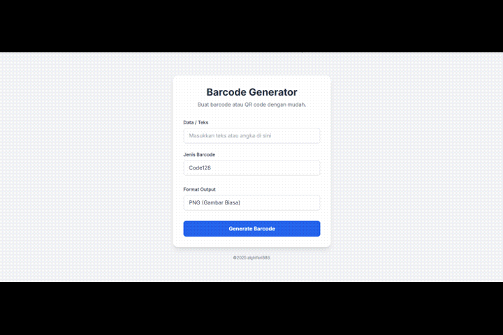

# Barcode Generator - Aplikasi Web Flask

<div align="center">

## 🎥 Demo


</div>


<p align="center">
  Sebuah aplikasi web sederhana namun kuat yang dibangun dengan Python dan Flask untuk membuat berbagai jenis barcode dan QR code secara instan.
</p>


---

### ✨ Kutipan

> *"Aku tidak berilmu; yang berilmu hanyalah DIA. Jika tampak ilmu dariku, itu hanyalah pantulan dari Cahaya-Nya."*

---

## 📋 Fitur Utama

Aplikasi ini dilengkapi dengan berbagai fitur untuk memenuhi kebutuhan pembuatan barcode Anda:

-   **Beragam Jenis Barcode**: Mendukung barcode linear populer seperti **Code128**, **EAN-13**, dan **UPC-A**.
-   **Generator QR Code**: Membuat QR Code dari teks atau URL apa pun.
-   **Kustomisasi Tampilan**: Ubah warna utama dan latar belakang QR Code sesuai kebutuhan branding.
-   **Format Download Fleksibel**: Unduh barcode dalam format **PNG** (gambar) atau **SVG** (vektor berkualitas tinggi).
-   **Antarmuka Responsif**: Tampilan yang bersih dan modern, dapat diakses dengan baik di desktop maupun perangkat mobile.
-   **Validasi Input**: Validasi otomatis untuk memastikan data sesuai dengan format barcode yang dipilih.

---

## 🛠️ Teknologi yang Digunakan

Proyek ini dibangun menggunakan teknologi modern dan pustaka Python yang andal:

-   **Backend**: Flask
-   **Library Barcode**: `python-barcode`
-   **Library QR Code**: `qrcode[pil]`
-   **Frontend**: HTML5, Tailwind CSS (via CDN)
-   **Server Produksi (Rekomendasi)**: Gunicorn, Nginx

---

## 💻 Spesifikasi Sistem

Untuk menjalankan aplikasi ini, Anda hanya memerlukan:

-   **Python** versi 3.8 atau yang lebih baru
-   **pip** (Package Installer for Python)

---

## 🚀 Panduan Instalasi

Berikut adalah panduan lengkap untuk menjalankan aplikasi ini, baik di lingkungan lokal untuk pengembangan maupun di server produksi untuk diakses publik.

### A. Instalasi di Komputer Lokal (Untuk Pengembangan)

Ikuti langkah-langkah ini untuk menjalankan aplikasi di mesin Anda sendiri.

1.  **Clone Repositori**
    Gunakan Git untuk meng-clone repositori ini ke komputer Anda.
    ```bash
    git clone [https://github.com/username/barcode-generator.git](https://github.com/username/barcode-generator.git)
    cd barcode-generator
    ```

2.  **Buat dan Aktifkan Virtual Environment**
    Sangat disarankan untuk menggunakan lingkungan virtual agar dependensi proyek tidak tercampur.
    ```bash
    # Membuat environment (misal: .venv)
    python -m venv .venv

    # Mengaktifkan environment
    # Windows
    .\.venv\Scripts\activate
    # macOS / Linux
    source .venv/bin/activate
    ```

3.  **Instal Dependensi**
    Instal semua library Python yang dibutuhkan yang tercantum dalam file `requirements.txt`.
    ```bash
    pip install -r requirements.txt
    ```

4.  **Jalankan Aplikasi**
    Setelah semua dependensi terinstal, jalankan server pengembangan Flask.
    ```bash
    python app.py
    ```

5.  **Buka di Browser**
    Aplikasi sekarang berjalan! Buka browser Anda dan kunjungi alamat `http://127.0.0.1:5000`.

### B. Deployment ke Server (Hosting)

Setelah siap untuk go-live, berikut cara mendeploy aplikasi ini.

#### 1. Shared Hosting (cPanel)

Metode ini cocok untuk pemula, namun pastikan penyedia hosting Anda mendukung aplikasi Python (fitur "Setup Python App").

1.  **Login ke cPanel** dan cari menu **"Setup Python App"**.
2.  **Buat Aplikasi Baru**:
    -   Pilih versi Python (misal: 3.9).
    -   Tentukan direktori aplikasi (misal: `barcode-app`).
    -   Tentukan URL yang akan digunakan.
3.  **Upload File Proyek**:
    -   Masuk ke **"File Manager"** dan navigasikan ke direktori yang baru saja Anda buat.
    -   Upload semua file proyek (`app.py`, `requirements.txt`, folder `templates`, dan `static`).
4.  **Buat File WSGI Entry Point**:
    -   Di dalam direktori aplikasi, buat file baru bernama `passenger_wsgi.py`.
    -   Isi file tersebut dengan kode berikut. Ini adalah jembatan antara server dan aplikasi Flask Anda.
      ```python
      from app import app as application
      ```
5.  **Instal Dependensi**:
    -   Kembali ke menu **"Setup Python App"**.
    -   Di bagian "Configuration files", tambahkan path ke `requirements.txt` Anda (misal: `/home/username/barcode-app/requirements.txt`).
    -   Klik **"Run Pip Install"**.
6.  **Restart Aplikasi**:
    -   Setelah instalasi selesai, klik tombol **"Restart"** di pojok kanan atas halaman "Setup Python App".
    -   Aplikasi Anda sekarang seharusnya sudah bisa diakses melalui URL yang telah ditentukan.

#### 2. Virtual Private Server (VPS)

Metode ini memberikan kontrol penuh dan performa terbaik. Panduan ini menggunakan **Ubuntu/Debian** dengan **Nginx** dan **Gunicorn**.

1.  **Setup Awal di VPS**:
    -   Pastikan Anda memiliki akses root atau sudo.
    -   Update sistem Anda: `sudo apt update && sudo apt upgrade -y`.
    -   Install Python, pip, dan Nginx: `sudo apt install python3-venv python3-pip nginx -y`.
2.  **Clone Proyek dan Setup Environment**:
    -   Clone repositori Anda: `git clone https://github.com/username/barcode-generator.git`.
    -   Masuk ke direktori proyek: `cd barcode-generator`.
    -   Buat dan aktifkan virtual environment seperti pada instalasi lokal.
    -   Instal dependensi: `pip install -r requirements.txt`.
    -   Instal Gunicorn: `pip install gunicorn`.
3.  **Jalankan Gunicorn sebagai Service (systemd)**:
    -   Buat file service untuk mengelola Gunicorn secara otomatis.
      ```bash
      sudo nano /etc/systemd/system/barcodeapp.service
      ```
    -   Isi file tersebut dengan konfigurasi berikut (sesuaikan `User` dan `WorkingDirectory`):
      ```ini
      [Unit]
      Description=Gunicorn instance to serve Barcode Generator
      After=network.target

      [Service]
      User=namauseranda # Ganti dengan username non-root Anda
      Group=www-data
      WorkingDirectory=/home/namauseranda/barcode-generator # Ganti pathnya
      Environment="PATH=/home/namauseranda/barcode-generator/.venv/bin"
      ExecStart=/home/namauseranda/barcode-generator/.venv/bin/gunicorn --workers 3 --bind unix:barcodeapp.sock -m 007 app:app

      [Install]
      WantedBy=multi-user.target
      ```
    -   Simpan file, lalu start dan enable service:
      ```bash
      sudo systemctl start barcodeapp
      sudo systemctl enable barcodeapp
      ```
4.  **Konfigurasi Nginx sebagai Reverse Proxy**:
    -   Buat file konfigurasi Nginx baru.
      ```bash
      sudo nano /etc/nginx/sites-available/barcodeapp
      ```
    -   Isi dengan konfigurasi berikut (ganti `your_domain`):
      ```nginx
      server {
          listen 80;
          server_name your_domain www.your_domain; # Ganti dengan domain Anda

          location / {
              include proxy_params;
              proxy_pass http://unix:/home/namauseranda/barcode-generator/barcodeapp.sock;
          }
      }
      ```
    -   Aktifkan konfigurasi dengan membuat symbolic link:
      ```bash
      sudo ln -s /etc/nginx/sites-available/barcodeapp /etc/nginx/sites-enabled
      ```
    -   Test konfigurasi Nginx dan restart:
      ```bash
      sudo nginx -t
      sudo systemctl restart nginx
      ```
5.  **Konfigurasi Firewall**:
    -   Izinkan trafik Nginx melalui firewall.
      ```bash
      sudo ufw allow 'Nginx Full'
      ```
    -   Aplikasi Anda kini sudah live di domain Anda! Untuk keamanan, sangat disarankan untuk menginstal SSL dengan Certbot.

---

## 📂 Struktur Proyek

Struktur folder dan file diatur agar rapi dan mudah dipahami.

```
barcode_app/
│
├── .venv/                  # Direktori virtual environment (opsional)
├── static/                 # Folder untuk file statis (CSS, JS, gambar)
│   └── barcodes/           # Tempat menyimpan gambar barcode yang dibuat
│
├── templates/              # Folder untuk file template HTML (Jinja2)
│   ├── index.html          # Halaman utama dengan form input
│   └── result.html         # Halaman untuk menampilkan hasil barcode
│
├── app.py                  # File utama aplikasi Flask (logika backend)
├── requirements.txt        # Daftar dependensi library Python
└── README.md               # File ini, dokumentasi proyek
```

---

## 🤝 Panduan Berkontribusi

Kami sangat menyambut kontribusi dari komunitas! Baik itu perbaikan bug, penambahan fitur, atau peningkatan dokumentasi.

### A. Melalui Fork (Untuk Non-Kolaborator)

Ini adalah cara standar untuk berkontribusi pada proyek open-source.

1.  **Fork** repositori ini di GitHub.
2.  **Clone** fork Anda ke mesin lokal: `git clone https://github.com/YourUsername/barcode-generator.git`.
3.  Buat **Branch Baru** untuk perubahan Anda: `git checkout -b fitur/nama-fitur-baru`.
4.  **Lakukan Perubahan** dan **Commit**: `git commit -m "feat: Menambahkan fitur X"`.
5.  **Push** ke branch Anda di fork: `git push origin fitur/nama-fitur-baru`.
6.  Buka repositori asli dan buat **Pull Request (PR)** dari branch Anda.

### B. Sebagai Kolaborator

Jika Anda memiliki akses tulis langsung ke repositori.

1.  **Clone** repositori ini ke mesin lokal.
2.  Buat **Branch Baru** untuk setiap tugas: `git checkout -b fix/perbaikan-bug-Y`.
3.  **Lakukan Perubahan** dan **Commit**.
4.  **Push** branch Anda langsung ke repositori utama.
5.  (Opsional) Buat Pull Request untuk proses review kode oleh tim.

### Pedoman Kontribusi

-   **Pesan Commit**: Gunakan format *Conventional Commits* untuk pesan commit yang jelas (misal: `feat:`, `fix:`, `docs:`, `style:`, `refactor:`).
-   **Gaya Kode**: Ikuti panduan gaya **PEP 8** untuk kode Python.
-   **Isu**: Laporkan bug atau usulkan fitur baru melalui tab "Issues" di GitHub sebelum membuat Pull Request besar.

Terima kasih telah mempertimbangkan untuk berkontribusi!
